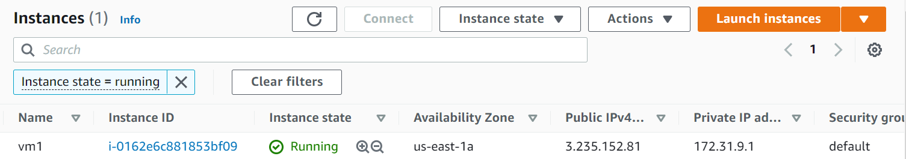
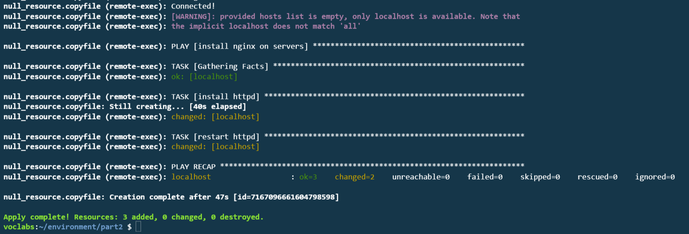
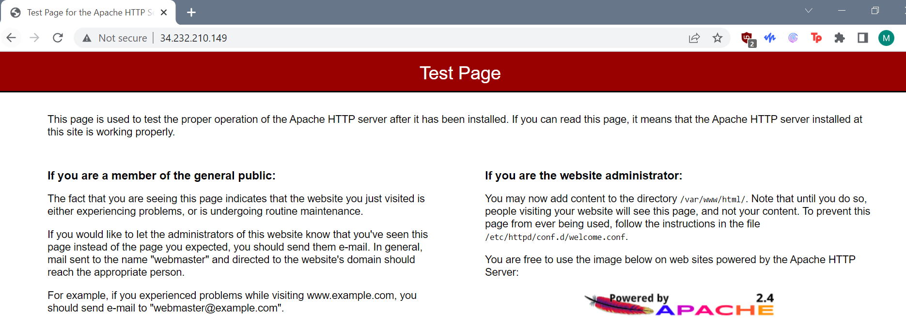
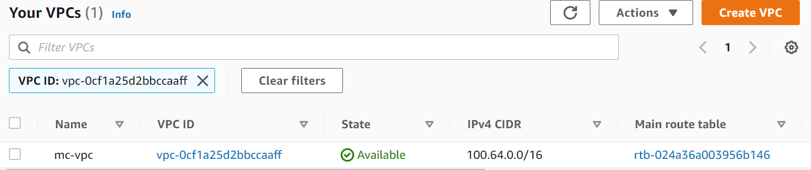
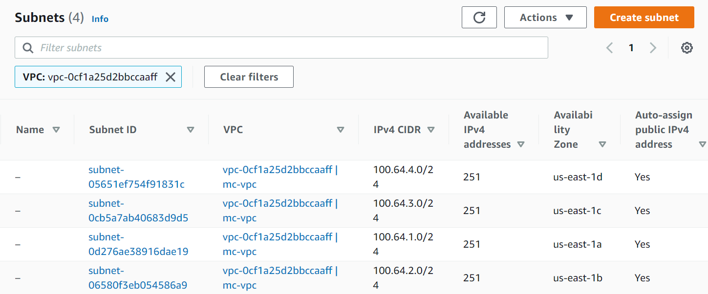
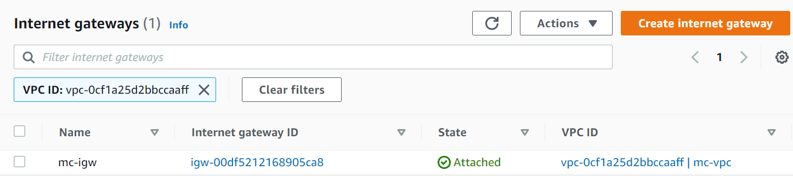
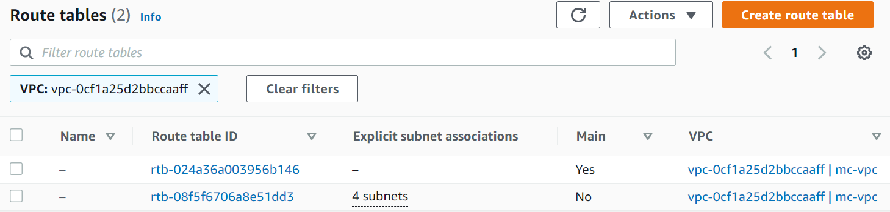

# lab-03-terraform-assignment

For each task, the following commands were excuted in order:
```
terraform init
```
```
terraform plan
```
```
terraform apply -auto-approve
```

Whenever a resource is not being used a `terraform destroy` should be issued.

## Part 1

In this task, a terraform script was created in order to deploy a basic EC2 instance. This script launched one EC2 instance using the latest AMI image, in the availability zone us-east-1a. A public IP address is assigned, and the vm tag "vm1" is added. Below displays the EC2 nstance created. 



## Part 2
The terraform script for part 2, launches an Amazon AMI Ec2 instance and copies a simple webserver configuration playbook in the /tmp/ directory, to the EC2 after it is launched. An ansible installation is prompted by a `remote-exec` provisioner. The remote-exec provisioner runs the playbook after the ansible installation using `ansible-playbook /tmp/webserver.yml` on the localhost. The following screenshots display the outputs after a succesful `terraform apply` as done in the cloud9 environment. 




Using the public IP address assigned the to the webserver, the default apache website is loaded successfully. 



## Part 3
### Local Module
In this step, a local module is created to deploy an EC2 instance webserver. The folders: **securitygroup** and **webserver** were created, one for each module that is referenced within the **root main.tf**. The **securitygroup module**, creates a security group with a simple inbound rule that permits all HTTP traffic to access the webserver, as well as an outbound rule permitting all traffic. The webserver module creates an AMI EC2 instance with apache installed and configured. Since it is a local module, the aws provider is modified to use the .aws/credentials profile. 

Once the terraform apply is completed, the new EC2 instance can be seen running in the GUI as shown below:


Using the public IP address assigned to the instance, it is confirmed that the webserver is configured correctly as shown by the output below of the web page.


### Remote Module
A terraform script was created to deploy a simple VPC with four public subnets. Each subnet is located within a different availability zone. A route table is created and a public route is created to provide internet access outside of the VPC. The public subnets created are then associated to the public route. The script referenced in the module was hosted within a public repository called **RemoteMod**, (however, the code for the module is also located within this repository to review all the scripts together) and the module was called from the root main.tf. The images below display the creation of the VPC and its components.

Displays the new VPC created called mc-vpc, with the IPv4 CIDR block 100.64.0.0/16:



Displays the four public subnets created within mc-vpc, each with a different CIDR block and within a different availability zone. Notice the auto-assign public IPv4 address is set to yes, allowing any EC2 instance created within the subnet to obtain a public IP address by default.



The following image displays the internet gateway created and attached to the VPC created.  



Displays the two routes created on the route table for the VPC, one is the default and the other contains the four subnets that were created.


