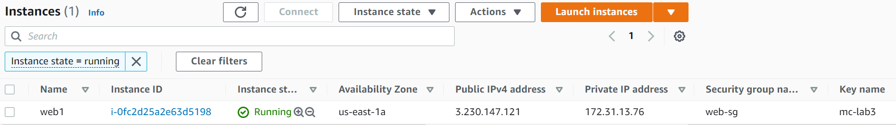

# lab-03-terraform-assignment

## Part 1

## Part 2


## Part 3
### Local Module
In this step, a local module is created to deploy an EC2 instance webserver. The folders: **securitygroup** and **webserver** were created, one for each module that is referenced within the root main.tf. The securitygroup module, creates a security group with a simple inbound rule that permits all HTTP traffic to access the webserver. The webserver module creates an AMI EC2 instance with apache installed and configured. Since it is a local module, the aws provider is modified to use the .aws/credentials profile. The following commands are then executed in order.
```
terraform init
terraform plan
terraform apply -auto-approve
```
Once the terraform apply is completed, the new EC2 instance can be seen running in the GUI as shown below:


Using the public IP address assigned to the instance, it is confirmed that the webserver is configured correctly as shown by the output below of the web page.


### Remote Module